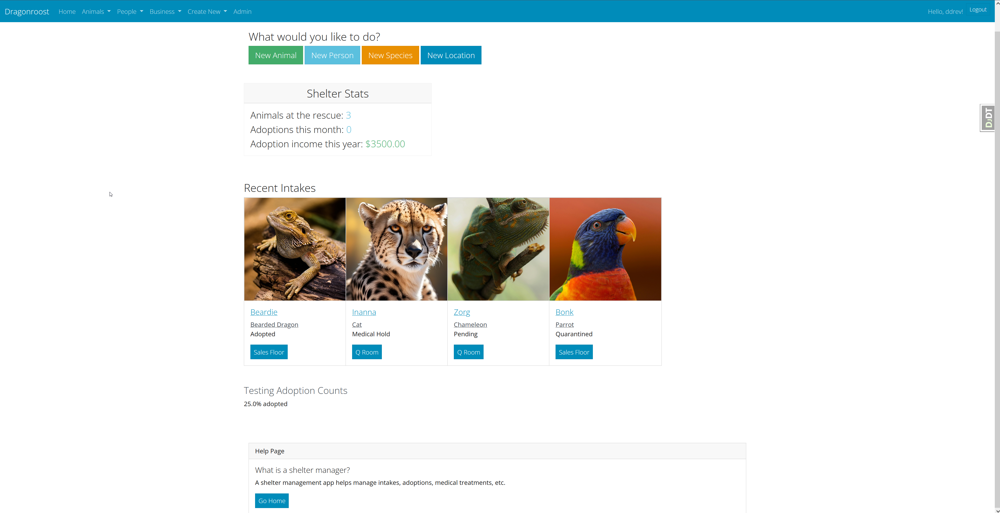
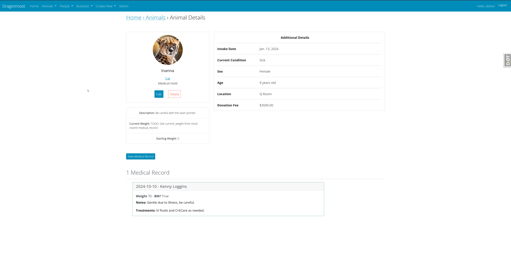

# Open Animal Rescue (OAR)

An open-source animal rescue and shelter management application written in Python, using the Django framework.

License: MIT

## Formerly "Dragonroost"

This repository is a re-implementation of [Dragonroost](https://github.com/leethobbit/dragonroost) - based on the well-known Cookiecutter-Django template for a better (and more standard) development experience. Some of the screenshots shown may contain views and templates that are not fully ported over yet, but show off some of the best features of this app.

## Settings

Moved to [settings](http://cookiecutter-django.readthedocs.io/en/latest/settings.html).

## Basic Commands

### Setting Up Your Users

- To create a **normal user account**, just go to Sign Up and fill out the form. Once you submit it, you'll see a "Verify Your E-mail Address" page. Go to your console to see a simulated email verification message. Copy the link into your browser. Now the user's email should be verified and ready to go.

- To create a **superuser account**, use this command:

      $ python manage.py createsuperuser

For convenience, you can keep your normal user logged in on Chrome and your superuser logged in on Firefox (or similar), so that you can see how the site behaves for both kinds of users.

### Type checks

Running type checks with mypy:

    $ mypy oar

### Test coverage

To run the tests, check your test coverage, and generate an HTML coverage report:

    $ coverage run -m pytest
    $ coverage html
    $ open htmlcov/index.html

#### Running tests with pytest

    $ pytest

### Live reloading and Sass CSS compilation

Moved to [Live reloading and SASS compilation](https://cookiecutter-django.readthedocs.io/en/latest/developing-locally.html#sass-compilation-live-reloading).

## Deployment

The following details how to deploy this application.

### Docker

See detailed [cookiecutter-django Docker documentation](http://cookiecutter-django.readthedocs.io/en/latest/deployment-with-docker.html).
